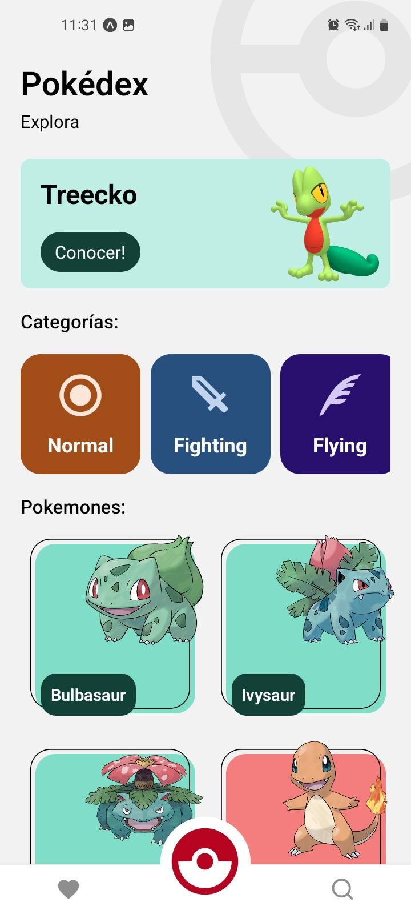
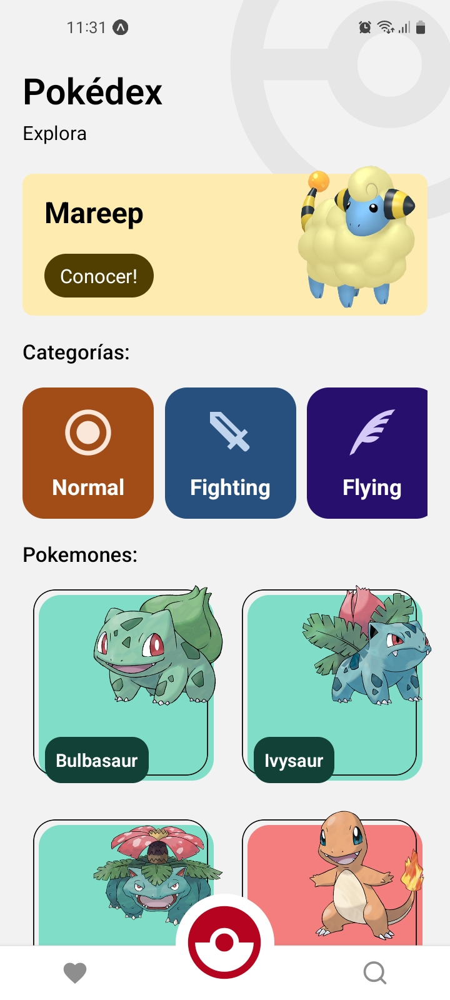
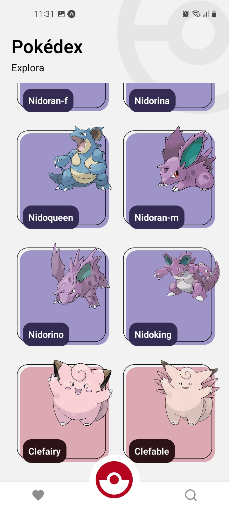
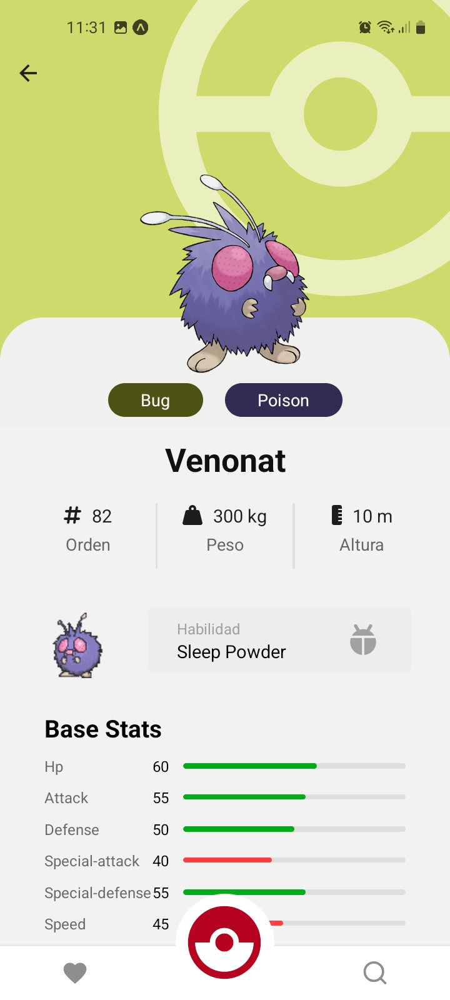
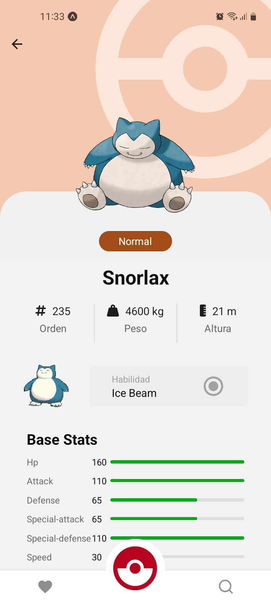
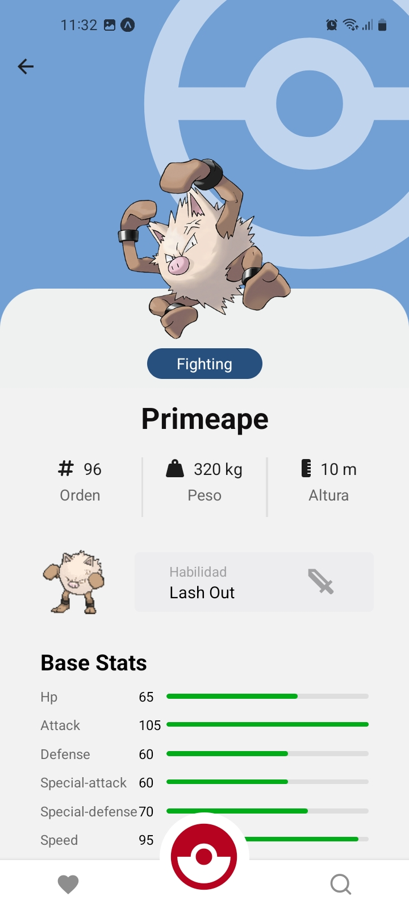
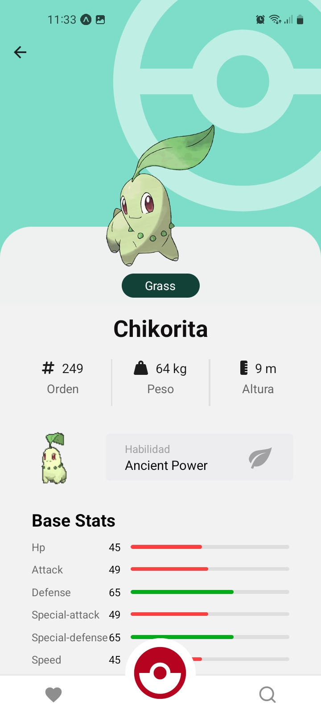

# POKE

  

This is a mobile application, developed in react native, to practice and learn this framework, which was inspired by a Pokedex from the famous Pokemon anime, in which you can perform certain functions and meet different pokemon, using pokeApi.

## 📱 Screenshots

  
  
  
  
  
  
  

